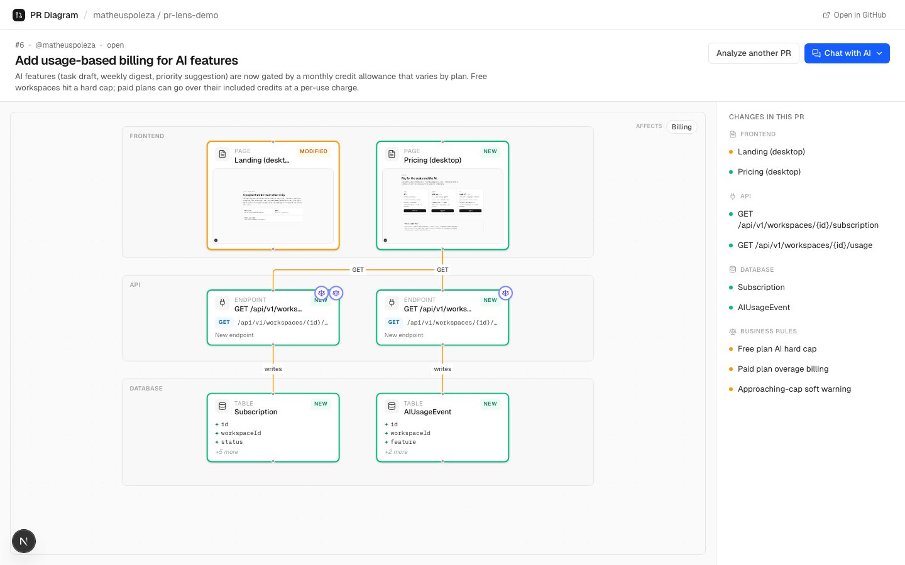
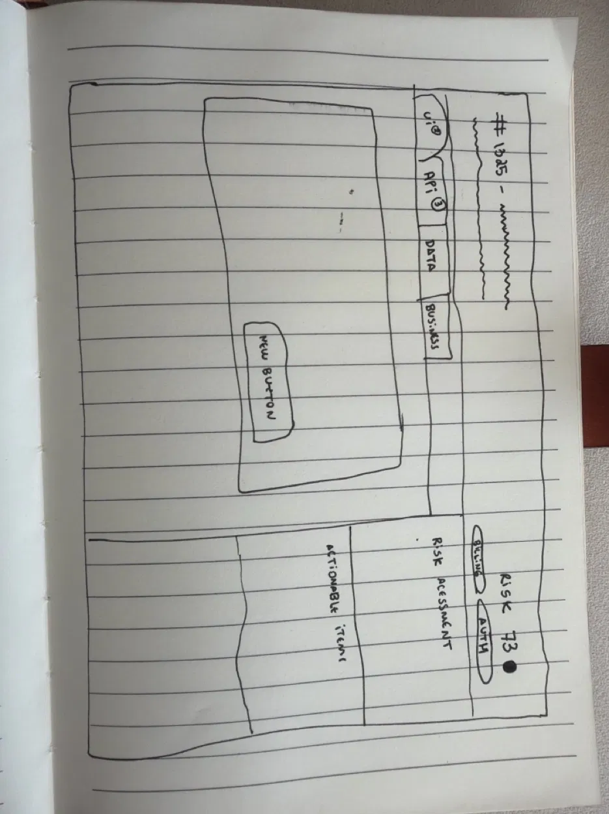
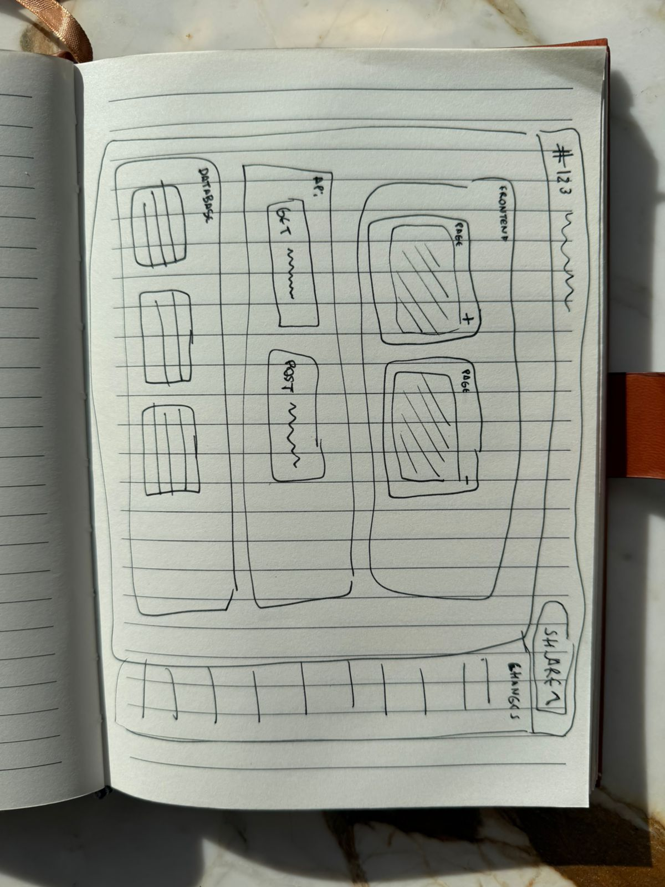

# PR Diagram

Turn any GitHub pull request into a visual diagram you can understand in seconds.

Drop in a PR URL, get a navigable map of every page, endpoint, table, and rule the PR touches — layered so a non-engineer can read a release without reading the code.



## Why it's just a diagram

The first cut had four pillars (UI / API / Data / Business) with tabs, a sidebar, a risk score, and actionable items. It worked. It was also too much.

<table>
  <tr>
    <td width="50%"></td>
    <td width="50%"></td>
  </tr>
  <tr>
    <td><sub><b>Initial sketch.</b> Header, tabs (UI/API/Data/Business), risk score, actionable items — a dashboard.</sub></td>
    <td><sub><b>Revision.</b> Drop everything. Three layers (Frontend / API / Database), edges between them, one shared change index.</sub></td>
  </tr>
</table>

If the value prop is "understand a PR in 10 seconds," a dashboard fails by construction — every tab is a decision the reader has to make before they get to the answer. A single screen wins. So three quarters of the UI got deleted and the diagram carries the load: nodes for pages, endpoints, and tables; edges for the rules between them; an index sidebar to jump around; a detail panel for any node you click.

What stayed: the diagram, a focused detail view, a change index. That's it.

## What's intentionally constrained

To make the visible product work end-to-end, the backend is narrow on purpose:

- **Public GitHub repos only.** No OAuth, no token management. Anonymous REST is enough.
- **One stack supported.** TypeScript, Prisma, an OpenAPI spec, and a config file declaring preview routes. Ineligible repos get a clear "missing X" page instead of guessing.
- **One demo repo carries the load.** The pipeline runs against a real PR end-to-end, against deterministic inputs.

The bet: the visible product is the only thing that proves the idea. Generalized diff extraction is the deep engineering work, but shipping it badly is worse than not shipping it.

## Where v2 would go

- A small CLI / GitHub app installed in the target repo, so the analyzer works from a *baseline* of how the app behaves (routes, schema, contracts) instead of guessing from the diff.
- Index the codebase once; diff against the index instead of parsing every PR from scratch.
- Stack adapters (Rails / Django / Go) over a shared typed-extraction core.

## Running it

```bash
bun install
bun dev
```

Then [http://localhost:3000](http://localhost:3000). Demo mode is the default — no API key needed. Set `ANTHROPIC_API_KEY` to enable LLM enrichment and `GITHUB_TOKEN` to lift the public rate limit.
